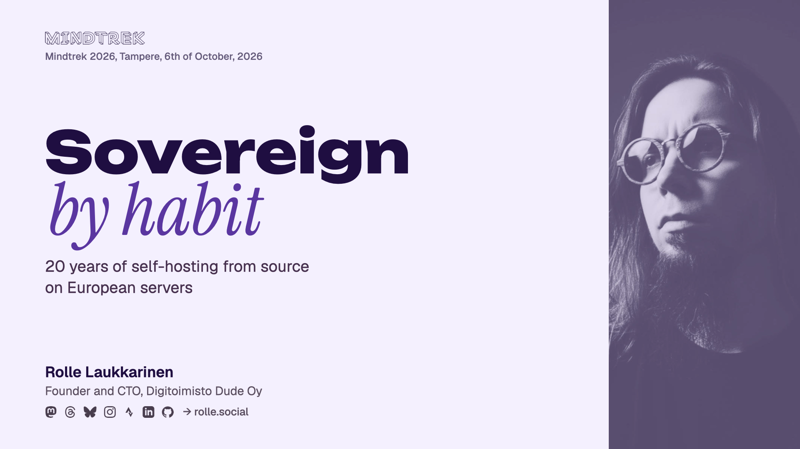

<h1 align="center">🗄️ Sovereign by habit</h1>

<p align="center">
  <strong>20 years of self-hosting from source on European servers. A talk for Mindtrek 2026.</strong>
</p>

<p align="center">
  
  
  
  
  
  
</p>

---



> [!IMPORTANT]
> These slides are a work in progress and subject to change until the talk has been given.

## The talk

| | |
| -- | -- |
| Event | [Mindtrek 2026](https://www.mindtrek.org/2026/program/), Finnkino Cine Atlas, Tampere |
| Talk page | [mindtrek.org/speaker/rolle-laukkarinen](https://www.mindtrek.org/speaker/rolle-laukkarinen/) |
| Slot | Tuesday 6.10.2026, 11:45-12:15, Developers track, 20 minutes plus Q&A |
| Audience | Developers working with open source, and students |

Europe's digital sovereignty is usually talked about as a strategy. The talk looks at it from the daily work of one small agency: servers run from source and from upstream, the work involved, the benefits, and how to start.

## Where to start

The tips from the talk, in a little more detail.

**Start here, new to running servers**

1. **Start on your own computer.** Use Linux, run one service, and read its config files, not just the docs.
2. **Rent the smallest VPS and set it up yourself.** SSH keys, a firewall, nginx and TLS. Lock yourself out on purpose and get back in through the provider's console.
3. **Write every step down.** Then start scripting.

**Go further, already running servers**

4. **Move one service you subscribe to onto your own server,** for example Plausible for analytics or Outline for docs.
5. **Swap one installed package for a source build.** Try to see if it compiles via a script or Ansible.
6. **Test your exit.** Restore a backup, and move one service to another provider. If it takes weeks, you are locked in.

## Reading

| | |
| -- | -- |
| [awesome-selfhosted](https://github.com/awesome-selfhosted/awesome-selfhosted) | A long, maintained list of software you can host yourself |
| [european-alternatives.eu](https://european-alternatives.eu/) | European alternatives to big tech services |
| [nginx downloads](https://nginx.org/en/download.html) | Mainline and stable source releases |
| [Building nginx from sources](https://nginx.org/en/docs/configure.html) | The configure options, including dynamic modules |
| [USN-8398-1](https://ubuntu.com/security/notices/USN-8398-1) and [USN-8398-2](https://ubuntu.com/security/notices/USN-8398-2) | The June 2026 Ubuntu nginx update, its crash with external modules, and the revert |
| [Duden harharetki palvelinmaailmassa](https://www.dude.fi/harharetki-palvelinmaailmassa) | The 2016 outage and the move to Finland, in Finnish |
| [Dude 10 vuotta, osa 2: Palvelimet](https://www.dude.fi/dude-10-vuotta-osa-2-palvelimet) | The history of Dude's servers, in Finnish |
| [air-light](https://github.com/digitoimistodude/air-light) | Dude's open source WordPress starter theme |

## Structure

| Path | What it is |
| -- | -- |
| `Sovereign by habit.key` | The deck used for presenting, and the source of truth |
| `export/` | Exports for the organisers: `.pptx` and `.pdf` |
| `keyassets/` | Logos, diagram parts and brand assets used on the slides |
| `photos/` | Photos used on the About slide |
| `cover.png` | The cover slide, for this README |
| `tools/` | Helpers for editing the open deck in Keynote: diagrams, the logo wall and text |
| `talk.py` | Talk length settings used by the timing bar script |
| `minutes.json` | Estimated minutes per slide, used by the footer timing bars |

## Working on the deck

The first version of the deck was generated with [keynote-base](https://github.com/rollecode/keynote-base). Since then it has been edited in Keynote, and it is not generated again. Diagrams are rebuilt with `tools/visuals.py`, where every box, arrow and icon is its own object and every label is editable text.

The timing bar in each slide footer shows how many minutes into the talk you should be on that slide. After adding or moving slides, update `minutes.json` and run this in the keynote-base root:

```bash
python3 scripts/refresh-progress.py talks/mindtrek-2026 --minutes=minutes.json
```
